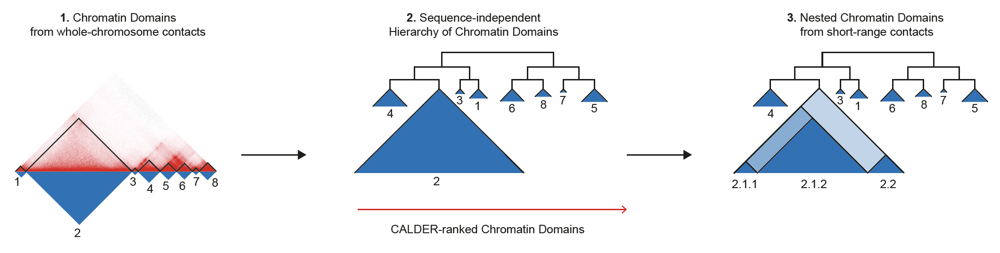
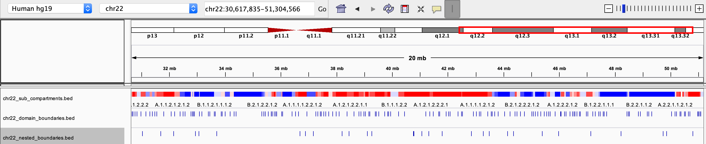

# CALDER user manuel

CALDER is a Hi-C analysis tool that allows: (1) compute chromatin domains from whole chromosome contacts; (2) derive their non-linear hierarchical organization and obtain sub-compartments; (3) compute nested sub-domains within each chromatin domain from short-range contacts. CALDER is currently implemented in R.




# Installation


## Make sure all dependencies have been installed:

* R.utils (>= 2.9.0),
* doParallel (>= 1.0.15),
* ape (>= 5.3),
* dendextend (>= 1.12.0),
* fitdistrplus (>= 1.0.14),
* igraph (>= 1.2.4.1),
* Matrix (>= 1.2.17),
* rARPACK (>= 0.11.0),
* factoextra (>= 1.0.5),
* maptools (>= 0.9.5),
* data.table (>= 1.12.2),
* fields (>= 9.8.3),
* GenomicRanges (>= 1.36.0)

## Clone its repository and install it from source:

`git clone https://github.com/CSOgroup/CALDER.git`

`install.packages(path_to_CALDER, repos = NULL, type="source")` ## install from the cloned source file


Please contact yliueagle@googlemail.com for any questions about installation.


# Usage

The input data of CALDER is a three-column text file storing the contact table of a full chromosome (zipped format is acceptable, as long as it can be read by `data.table::fread`). Each row represents a contact record `pos_x, pos_y, contact_value`, which is the same format as that generated by the `dump` command of juicer (https://github.com/aidenlab/juicer/wiki/Data-Extraction):	

	16050000	16050000	10106.306
	16050000	16060000	2259.247
	16060000	16060000	7748.551
	16050000	16070000	1251.3663
	16060000	16070000	4456.1245
	16070000	16070000	4211.7393
	16050000	16080000	522.0705
	16060000	16080000	983.1761
	16070000	16080000	1996.749
	...

A demo dataset is included in the repository `CALDER/inst/extdata/mat_chr22_10kb_ob.txt.gz` and can be accessed by `system.file("extdata", "mat_chr22_10kb_ob.txt.gz", package='CALDER')` once CALDER is installed. This data contains contact values of GM12878 on chr22 binned at 10kb (Rao et al. 2014) 

CALDER contains three modules: (1) compute chromatin domains; (2) derive their hierarchical organization and obtain sub-compartments; (3) compute nested sub-domains within each compartment domain.

### To run three modules in a single step:
```
CALDER_main(contact_mat_file, chr, bin_size, out_dir, sub_domains=TRUE, save_intermediate_data=FALSE)
```

### To run three modules in seperated steps:
```
CALDER_main(contact_mat_file, chr, bin_size, out_dir, sub_domains=FALSE, save_intermediate_data=TRUE) ## will not compute sub-domains, but save the intermediate_data that can be used to compute sub-domains latter on
CALDER_sub_domains(intermediate_data_file, chr, out_dir, bin_size) ## (optional depends on needs) compute sub-domains using intermediate_data_file that was previous saved in the out_dir (named as chrxx_intermediate_data.Rds)
```

### Paramters:

* `contact_mat_file`: path to the contact table of a chromosome
* `chr`: chromosome number. Either numeric or character, will be pasted to the output name
* `bin_size`: numeric, the size of a bin in consistent with the contact table
* `out_dir`: the output directory
* `sub_domains`: logical, whether to compute nested sub-domains
* `save_intermediate_data`: logical. If TRUE, an intermediate_data will be saved. This file can be used for computing nested sub-domains later on

### Output:

#### chrxx_domain_hierachy.tsv
* information of compartment domain and their hierarchical organization. The hierarchical structure is fully represented by `compartment_label`, for example, `B.2.2.2` and `B.2.2.1` are two sub-branches of `B.2.2`. The `pos_end` column specifies all compartment domain borders, except when it is marked as `gap`, which indicates it is the border of a gap chromsome region that has too few contacts and was excluded from the analysis (e.g., due to low mappability, deletion, technique flaw) 

#### chrxx_sub_compartments.bed
* a .bed file containing the sub-compartment information, that can be visualized in IGV. Different colors were used to distinguish compartments (at the resolution of 8 sub-compartments)  

#### chrxx_domain_boundaries.bed
* a .bed file containing the chromatin domains boundaries, that can be visualized in IGV

#### chrxx_nested_boundaries.bed
* a .bed file containing the nested sub-domain boundaries, that can be visualized in IGV

#### chrxx_intermediate_data.Rds
* an Rds file storing the intermediate_data that can be used to compute nested sub-domains (if CALDER is run in two seperated steps)

#### chrxx_log.txt, chrxx_sub_domains_log.txt
* log file storing the status and running time of each step


### Runnig time:
For the computational requirement, running CALDER on the GM12878 Hi-C dataset at bin size of 40kb took **36 minutes** to derive the chromatin domains and their hierarchy for all chromosomes (i.e., CALDER Step1 and Step2); **13 minutes** to derive the nested sub-domains (i.e., CALDER Step3). At the bin size of 10kb, it took **1 h 44 minutes and 55 minutes** correspondingly (server information: 40 cores, 64GB Ram, Intel(R) Xeon(R) Silver 4210 CPU @ 2.20GHz). The evaluation was done using a single core although CALDER can be run in a parallel manner.

### Demo run:

```
library(CALDER)

contact_mat_file = system.file("extdata", "mat_chr22_10kb_ob.txt.gz", package = 'CALDER')

CALDER_main(contact_mat_file, chr=22, bin_size=10E3, out_dir='./GM12878', sub_domains=TRUE, save_intermediate_data=FALSE)
```

The saved .bed files can be view directly through IGV:



# Citation

If you use CALDER in your work, please cite: Liu, Y., Nanni, L., Sungalee, S., Zufferey, M., Tavernari, D., Mina, M., ... & Ciriello, G. (2021). Systematic inference and comparison of multi-scale chromatin sub-compartments connects spatial organization to cell phenotypes. Nature Communications, 12(1), 1-11.


# Contact information

* Author: Yuanlong LIU
* Affiliation: Computational Systems Oncology group, Department of Computational Biology, University of Lausanne, Switzerland
* Email: yliueagle@googlemail.com


